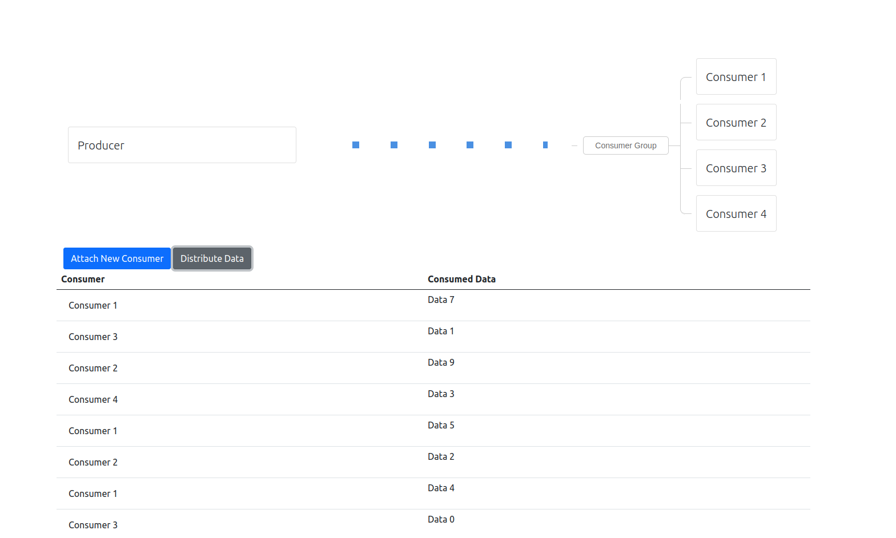

# rabbitmq-go-eda-tutorial
This contains a tutorial on how to use RabbitMQ in an event-driven architecture using Golang. This tutorial cover topics such as setting up RabbitMQ using Docker, creating producers and consumers, working with queues, exchanges, and bindings, and using RabbitMQ to build microservices that communicate using events.

# How to run the application

- Run rabbitmq with docker

    docker compose up

- Run the application

    go run main.go

- Access [http://localhost:8080/](http://localhost:8080/) in the web browser.
- Click `Attach new consumer` for new consumer
- Click `Distribute Data` to produce the sample datas